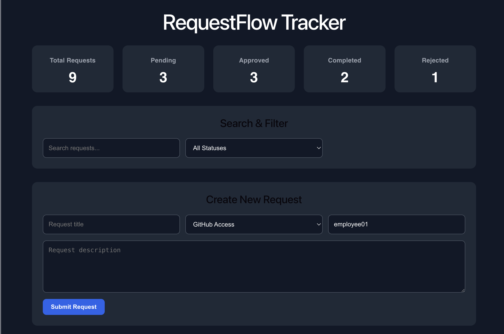
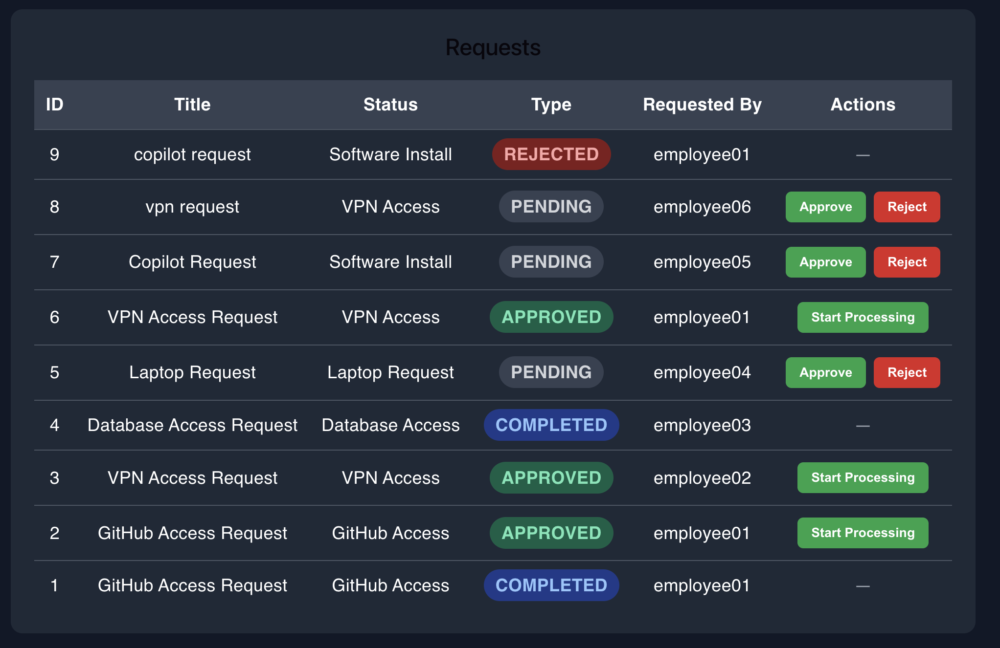
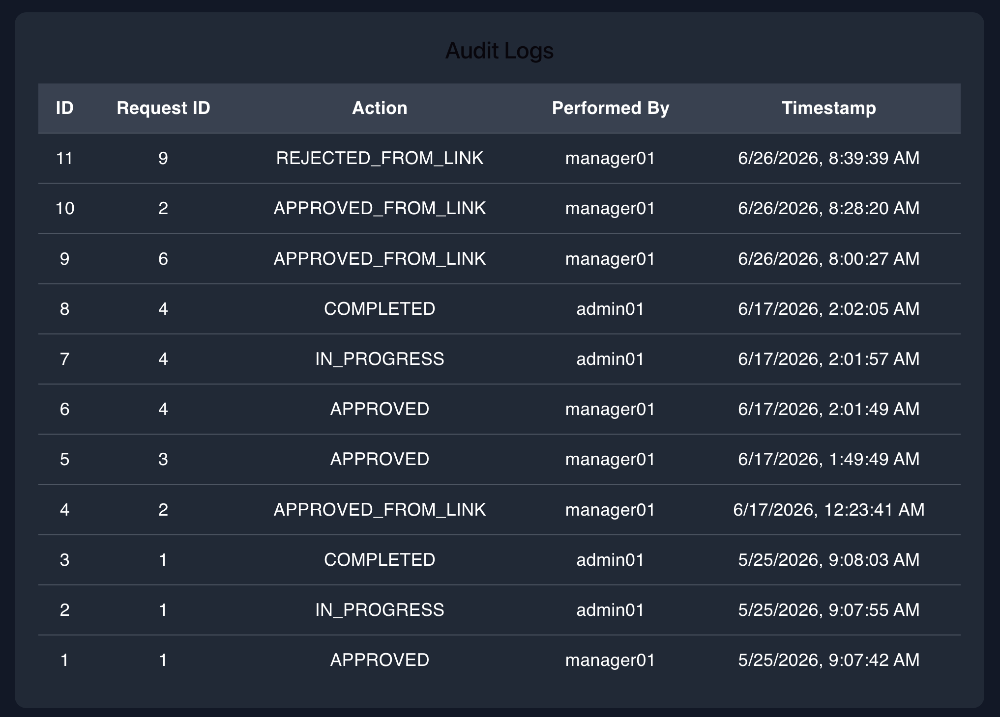
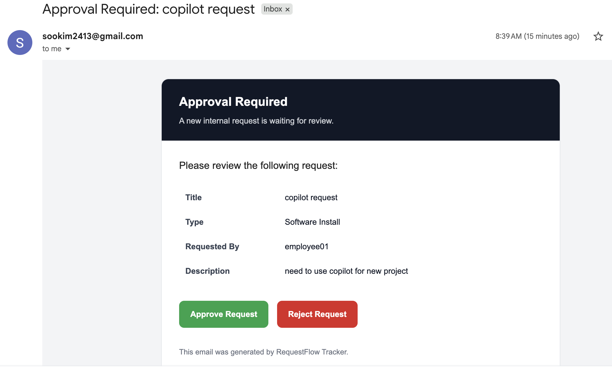
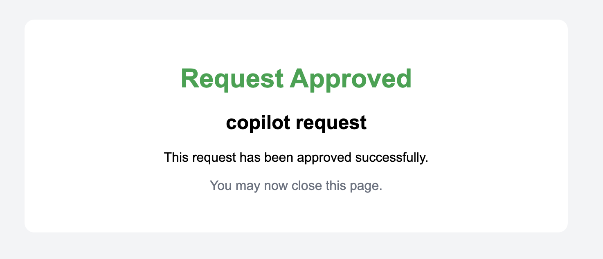
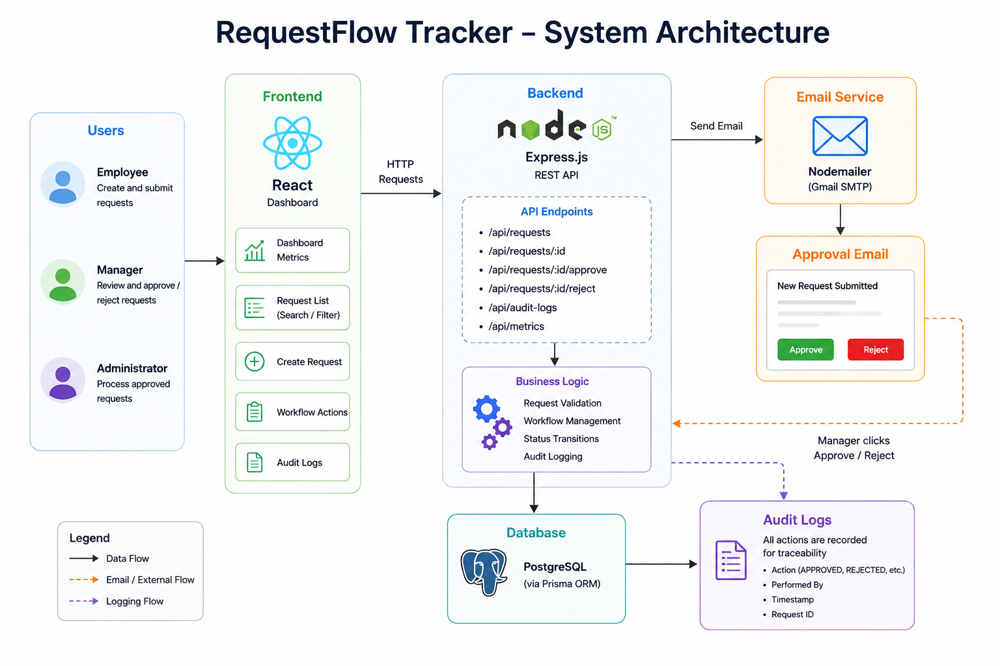

# RequestFlow Tracker

Enterprise-style internal request management system built with **React, Express, Prisma, and PostgreSQL**.

Inspired by a real enterprise workflow discussed during my internship at **RBC Capital Markets**, this project simulates how internal access requests move through an approval process from submission to completion.



---

# Project Motivation

During my internship at **RBC Capital Markets**, I had the opportunity to observe how internal request workflows support employees behind the scenes.

New hires often require access to repositories, VPNs, databases, software, and many other internal resources before they can begin their work.

While discussing potential side projects with my manager, we explored the idea of building an onboarding tool that could automatically organize and generate these access requests for new employees.

However, implementing such a system would require integration with internal enterprise infrastructure and privileged systems, which was not feasible because of security and access restrictions.

That conversation sparked my interest in enterprise workflow systems.

To better understand how these systems are designed, I decided to build **RequestFlow Tracker** as an independent full-stack project.

Rather than integrating with proprietary company platforms, this project focuses on recreating the core workflow commonly found in enterprise software.

The objective of this project was **not** to replicate any proprietary banking platform, but to gain hands-on experience designing and implementing enterprise approval workflows from scratch.

---

# Features

## Request Management

- Create new internal requests
- Support multiple request types
- Track request status throughout its lifecycle
- Search requests by title
- Filter requests by status
- Dashboard metrics for request statistics

---

## Enterprise Approval Workflow

The application simulates a multi-stage approval process commonly used in enterprise environments.

```text
Employee
    │
    ▼
Submit Request
    │
    ▼
Pending
    │
    ▼
Manager Review
 ┌────┴────┐
 │         │
 ▼         ▼
Reject   Approve
            │
            ▼
     In Progress
            │
            ▼
       Completed
```

Each stage updates the request status and automatically records an audit log.

---

## Email Notification

Whenever a new request is submitted, the system automatically sends a styled HTML email to the manager.

The email includes:

- Request title
- Request type
- Request description
- Requested employee
- One-click **Approve** button
- One-click **Reject** button

Managers can approve or reject requests directly from the email without opening the dashboard.

---

## Audit Logging

Every important workflow action is automatically recorded.

Supported audit events include:

- APPROVED
- REJECTED
- APPROVED_FROM_LINK
- REJECTED_FROM_LINK
- IN_PROGRESS
- COMPLETED

Each log records:

- Request ID
- Action performed
- User who performed the action
- Timestamp

---

## Dashboard

The dashboard provides:

- Live request metrics
- Request status summary
- Search functionality
- Status filtering
- Request management
- Workflow actions
- Audit log history

---

# Screenshots

## Dashboard Overview


Displays request metrics, search functionality, filters, and request creation.

---

## Request Management



Managers can approve or reject pending requests, while administrators continue processing approved requests.

---

## Audit Logs



Every workflow action is recorded to provide complete traceability.

---

## Approval Email



Managers receive an HTML email immediately after a new request is submitted.

---

## Approval Confirmation



After clicking the approval or rejection button, managers receive an immediate confirmation page.

---

# Tech Stack

## Frontend

- React
- Vite
- CSS

## Backend

- Node.js
- Express

## Database

- PostgreSQL
- Prisma ORM

## Email

- Nodemailer
- Gmail SMTP

---

# Architecture

The following diagram illustrates the overall architecture and request workflow of the application.



---

# Running Locally

## Backend

```bash
npm install
npm run dev
```

Runs on:

```
http://localhost:3000
```

---

## Frontend

```bash
npm install
npm run dev
```

Runs on:

```
http://localhost:5173
```

---

# Environment Variables

Create a `.env` file in the backend project.

```env
DATABASE_URL=your_database_url

EMAIL_USER=your_email

EMAIL_PASS=your_gmail_app_password
```

---

# Future Improvements

There are several enhancements that could further improve the project.

### Authentication & Authorization

- JWT authentication
- Login system
- Protected API routes
- Role-based permissions for Employees, Managers, and Administrators

---

### Enterprise Workflow

- Multiple approval levels
- Department-based approvals
- Configurable approval workflows
- Approval delegation
- Approval expiration

---

### Request Management

- Request comments
- File attachments
- Request editing
- Request cancellation
- Request history page

---

### Notifications

- Reminder emails for pending approvals
- Email notifications for status updates
- Slack or Microsoft Teams integration

---

### Dashboard

- Pagination
- Sorting
- Advanced filtering
- Analytics dashboard
- Export to CSV

---

### Deployment

- Docker support
- CI/CD pipeline
- Cloud deployment
- Production email service
- Environment-based configuration

---

### Testing

- Unit testing
- Integration testing
- API testing
- End-to-end testing

---

# What I Learned

Through this project I gained practical experience with:

- Designing enterprise approval workflows
- Building RESTful APIs with Express
- Structuring a full-stack application
- Database modeling using Prisma ORM
- PostgreSQL integration
- Sending transactional HTML emails with Nodemailer
- Building email-driven approval workflows
- Managing request lifecycle using status transitions
- Recording audit logs for traceability
- Implementing search and filtering features in React
- Separating business logic using a controller-service architecture
